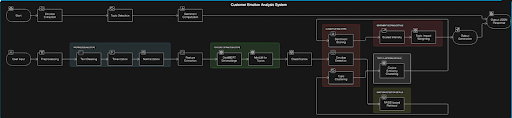
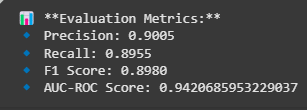
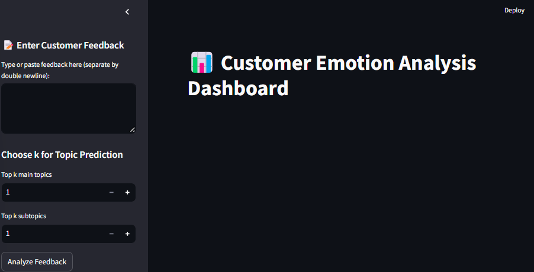
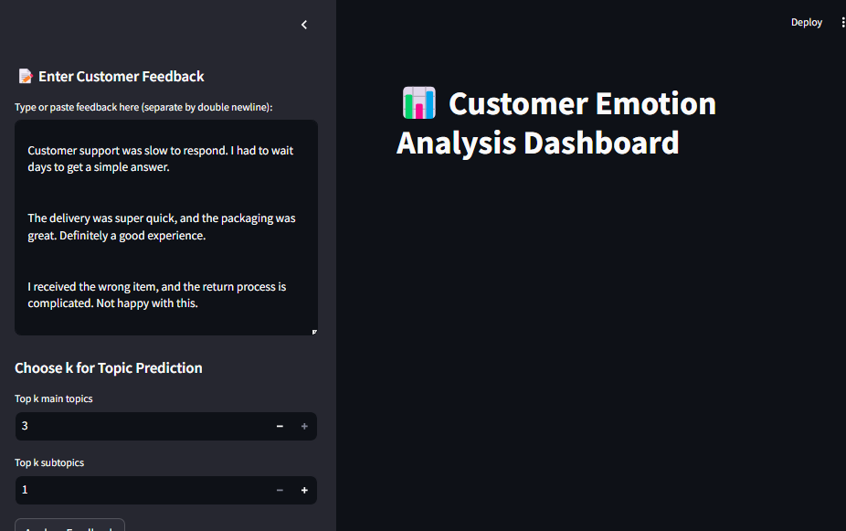
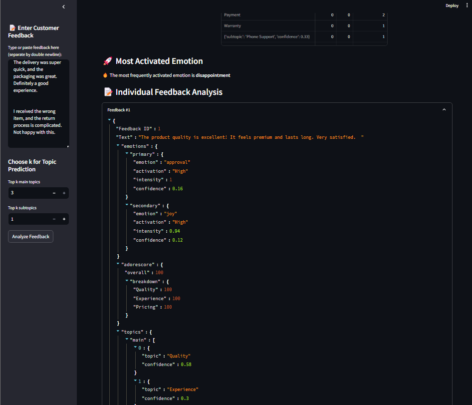
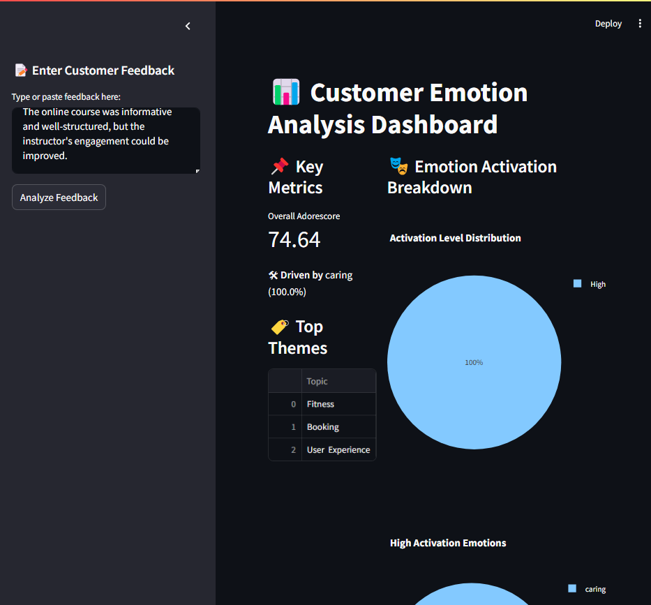
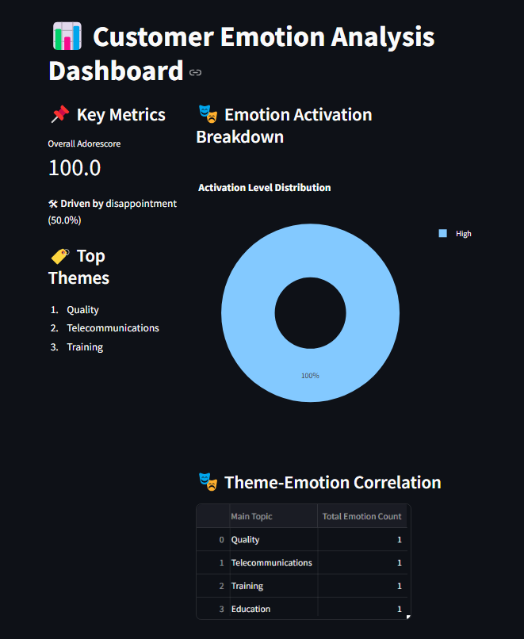

# 🎭 CustEmotiTrack



---

## 📚 Overview
**CustEmotiTrack** is an AI-powered **Customer Emotion Analysis System** designed to analyze and categorize customer feedback efficiently. It leverages **Machine Learning (ML), NLP, and FAISS-based similarity retrieval** to extract emotions, detect hierarchical topics, and compute sentiment scores.

---

## 🚀 Key Features
✅ **Emotion Detection:** Extracts user emotions using DistilBERT embeddings and FAISS-based similarity search.  
✅ **Topic & Subtopic Recognition:** Hierarchical topic modeling with MiniLM L6 Sentence Transformer.  
✅ **Adorescore Computation:** Weighs sentiment intensities and computes an engagement score between -100 to 100.  
✅ **Multilingual Support:** Google Translate API enhances cross-language compatibility.  
✅ **Streamlit UI:** Real-time feedback analysis with an interactive web interface.

---

## 🧠 System Architecture Overview
The architecture consists of several core components:

### 1.1 **Core Components**
- 🎯 **Data Preprocessing Module:** Cleans, normalizes, and balances customer feedback.
- 🎭 **Emotion Detection Module:** DistilBERT embeddings + FAISS HNSW similarity search.
- 🕵️ **Topic & Subtopic Recognition:** MiniLM embeddings with cosine similarity mapping.
- 🌐 **Multilingual Processing:** Google Translate API for cross-language support.
- 📊 **Adorescore Computation:** Sentiment intensity with topic-weighted scoring.
- 🎨 **Streamlit-based UI:** Provides real-time analysis and data visualization.

### 1.2 **Model Selection**
- **Emotion Classification:** DistilBERT (base-uncased-go-emotions) + FAISS HNSW retrieval.
- **Topic Modeling:** MiniLM L6 Transformer embeddings with cosine similarity-based clustering.
- **Sentiment Quantification:** Intensity scaling with topic-relevant weight adjustments.

---

## 📊 Data Flow Diagram (DFD)
### 2.1 **Level 0 (Context Diagram)**
- **Input:** Raw customer feedback.
- **Processing:**  
   - Emotion extraction  
   - Topic detection  
   - Sentiment computation  
- **Output:** JSON response with detected emotions, topics, and computed Adorescore.

### 2.2 **Level 1 (Detailed Data Flow)**
- **User Input:** Feedback received via Streamlit UI or API.
- **Preprocessing:** Text cleaning, tokenization, and normalization.
- **Feature Extraction:**  
   - DistilBERT embeddings for emotion detection  
   - MiniLM embeddings for topic recognition  
- **Classification:**
   - **Emotion:** FAISS HNSW similarity search.
   - **Topics:** Cosine similarity clustering.
- **Sentiment Scoring:** Intensity scaling weighted by topic impact.
- **Output Generation:** JSON response for UI or downstream applications.

---
## Project Structure

- **📂 CustEmotiTrack**
  - **📂 config/**
  - **📂 datasets/** (Raw & Processed Data)
  - **📂 evaluation/** (scripts)
    - `evaluate_emotions.py`
    - `evaluate_topic.py`
  - **📂models/** (Trained ML Models)
    - `emotion_model.pt`
    - `topic_model.pkl`
    - **tokenizer/**
    - `load_model.py` (emotion module)
    - `load_topic_model.py` (topic module)
    - `save_model.py`
    - `save_topic_model.py`
  - **📂streamlit_app/** (Frontend UI)
    - `app.py`
  - `gdrive_auth.py`
  - `README.md`
  - `requirements.txt` (Dependencies)
  - `LICENSE`

---
## 🔥 API Specifications
### 4.1 **Emotion Detection API**
- **Endpoint:** `/predict-emotion`
- **Input:**
```json
{
  "feedback": "The product quality is amazing!"
}
```
- **Processing:**  
   - DistilBERT feature extraction  
   - FAISS HNSW similarity classification  
- **Output:**
```json
{
  "emotions": [{"joy": 0.92}, {"admiration": 0.85}],
  "confidence": 0.95
}
```

---

### 4.2 **Topic Recognition API**
- **Endpoint:** `/predict-topic`
- **Input:**
```json
{
  "feedback": "The delivery was very fast and free!"
}
```
- **Processing:**  
   - MiniLM embeddings  
   - Cosine similarity for topic and subtopic mapping  
- **Output:**
```json
{
  "topic": "Delivery",
  "subtopic": "Fast Shipping",
  "relevance": 0.88
}
```

---

### 4.3 **Sentiment Scoring API**
- **Endpoint:** `/compute-adorescore`
- **Input:**
```json
{
  "emotions": [{"joy": 0.92}, {"admiration": 0.85}],
  "topics": [{"Delivery": 0.88}]
}
```
- **Processing:** Weighted sentiment scoring.
- **Output:**
```json
{
  "Adorescore": 75.4
}
```

---

## 🧪 Test Cases & Evaluation
| **Test Case**        | **Scenario**                  | **Expected Outcome**                       |
|---------------------|-------------------------------|------------------------------------------|
| Emotion Detection   | "Service was terrible!"        | { "anger": 0.91 }                        |
| Topic Recognition   | "Fast and free shipping"       | { "topic": "Delivery", "subtopic": "Fast Shipping" } |
| Multilingual Support| "El servicio fue excelente!"   | { "joy": 0.89 }                          |
| Adorescore Calculation | Valid emotion-topic input    | Computed Adorescore with relevance score |

---

## 🧠 Findings & Recommendations
### ✅ **Findings**
- FAISS-based retrieval enhances classification speed over deep neural models.
- Hybrid feature extraction embeddings boost classification accuracy.
- Google Translate API provides fast multilingual support but lacks contextual depth.

### 🚀 **Recommendations**
1. **Hybrid FAISS + Transformer Classification:** Combine retrieval search with neural models for improved results.  
2. **Advanced Topic Modeling:** Expand topic granularity using hierarchical clustering.  
3. **Contextual Sentiment Weighting:** Enhance Adorescore calculations by dynamically adjusting sentiment intensities.

---

## 💻 Hardware & System Requirements
### 7.1 **Hardware**
- **CPU:** Intel i5/i7 or AMD Ryzen 5/7 for local inference.  
- **GPU:** NVIDIA RTX 2060 or higher for model training.  
- **RAM:** Minimum 16GB for processing.  
- **Storage:** SSD with at least 50GB free space.  

### 7.2 **Software & Frameworks**
- **Python:** 3.8+  
- **Libraries:** PyTorch, FAISS, Hugging Face Transformers, Scikit-Learn, NLTK.  
- **Cloud Services:**  
   - Google Firebase (Data Storage)  
   - Google Translate API (Multilingual Support)  
- **Version Control:** GitHub for code and dataset versioning.  

---

## ⚡ Working Instructions
### 8.1 **Setup and Run**
```bash
# Navigate to the project directory
cd CustEmotiTrack

# Install dependencies
pip install -r requirements.txt

# Save emotion and topic models
python models/save_model.py
python models/save_topic_model.py

# Load trained models
python models/load_model.py
python models/load_topic_model.py

# Run Streamlit app
streamlit run streamlit_app/app.py
```

---

## 🎨 UI and Visuals
Checkout the following images in project folder 'output' for reference:
- `img1.png`, `img2.png`, `img3.png`, `img4.png`, `img5.png`, `test.png`





```
